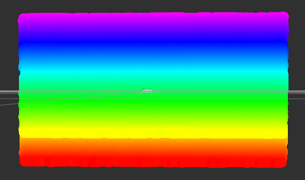
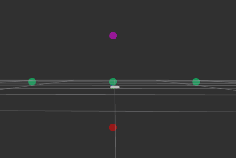
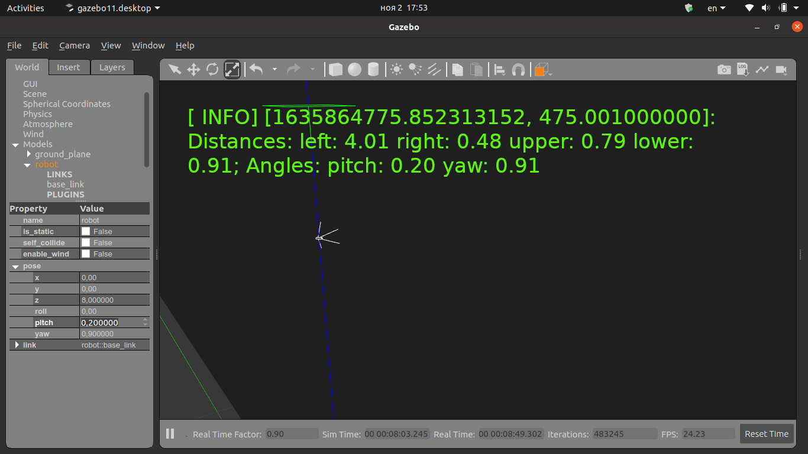
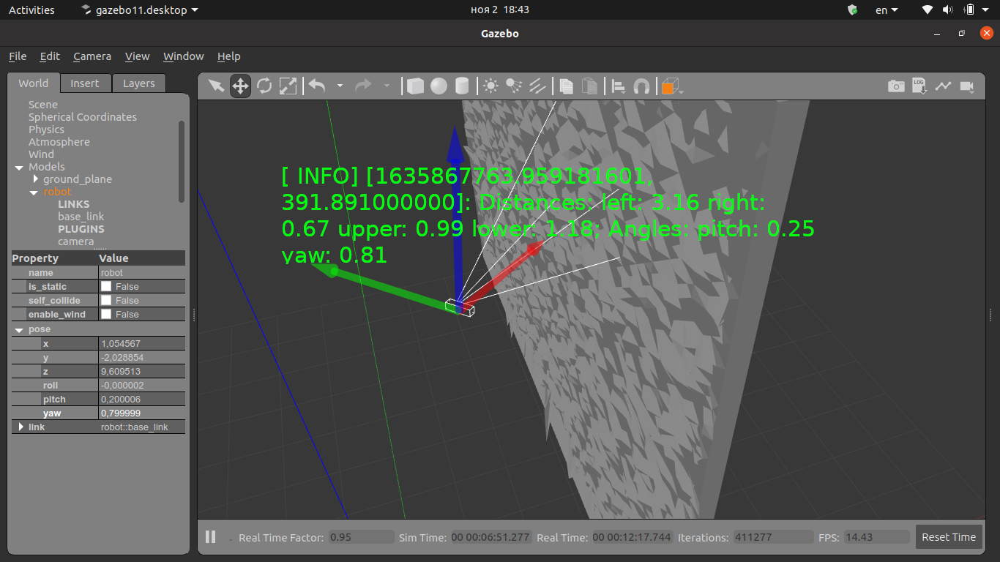
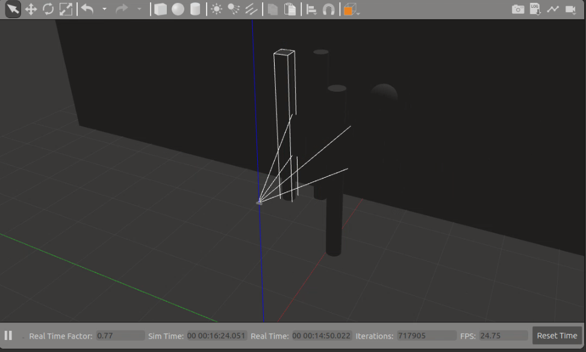
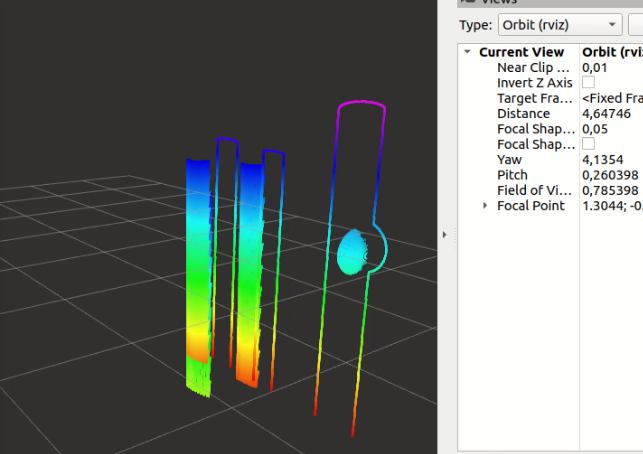
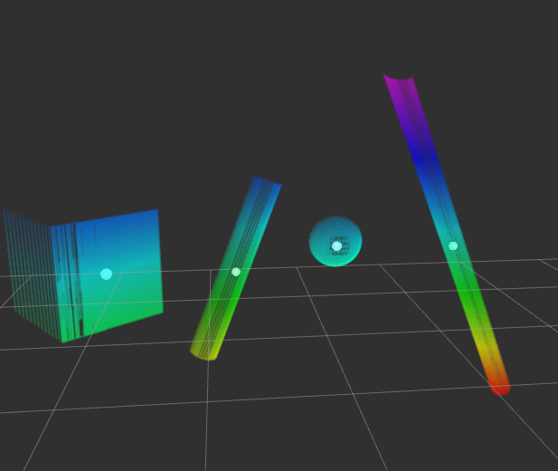

# Realsense Point Cloud Tests Package
This package consists of different tests of processing PointCloud2 messages published by realsense d435 camera
## Main distances
This program finds mean values of 5 pointcloud areas: Upper, lower, center, left and right kernels.
Launch:
~~~
roslaunch pointcloud_tests mean_distances.launch
~~~
Change meaning window:
~~~
rosparam set /mean_distances/window_size 5
~~~

## Yaw from main distances
This program calculate yaw and pitch from point cloud

The picture shows how program calculates angles with flat wall

The picture shows how program calculates angles with noisy wall without filters

Change window size to activate mean filter (see upper)

## Thresholding
Launch:
~~~
roslaunch pointcloud_tests adaptive_thresholding.launch
~~~
### Parameters
* __error__ - square of a mean and current distances difference divided on the mean distance and multiplied on 10000
* __square_size__ - square of points which center point is the current point

## Object detection

To launch object detection with threshold use:

~~~
roslaunch pointcloud_tests object_detection_with_threshold.launch
~~~

without threshold:

~~~
roslaunch pointcloud_tests object_detection.launch
~~~

### Algorithm

* Find a non-empty point
* Get a contour of object which starts and ends on the initial point
* Get all object points within the contour
* Repeat

